# Shareable ESLint/Prettier/TypeScript configurations

Recently, the [eslint-config-prettier v8 upgrade](https://github.com/prettier/eslint-config-prettier/blob/main/CHANGELOG.md#version-800-2021-02-21) broke my ESLint configuration, and I realized I needed a centralized way of managing my ESLint configuration across projects.

This is the outline for how I will solve common configuration across projects going forward.  Here are the key features:

* Layer your ESLint rules based on topics: ESLint + Prettier, then TypeScript, then React/Vue.
* Use Lerna to publish scoped packages to [npmjs](https://www.npmjs.com/).
* Some helper tools to upgrade your code.

Disclaimer: This is not my original work, but leveraged from other's work, most notably:

* The ESLint configuration started with [ntnyq](https://github.com/ntnyq/configs) configs
* The TypeScript idea came from [unlikelystudio](https://github.com/unlikelystudio/bases) settings 

## Layered ESLint

The benefit of this organizational structure is layering your ESLint rules.  Some rules apply for TypeScript projects.  Some for TypeScript/React projects.  What if you add Prettier to the mix?

A picture is worth a 1000 words:

[](https://mermaid-js.github.io/mermaid-live-editor/edit##eyJjb2RlIjoiZ3JhcGggVERcbiAgRVtlc2xpbnQtY29uZmlnXSAtLT4gRVBbZXNsaW50LWNvbmZpZy1wcmV0dGllcl1cbiAgRSAtLT4gRVRbZXNsaW50LWNvbmZpZy10eXBlc2NyaXB0XVxuXG4gIEVQIC0tPiBFUFJbZXNsaW50LWNvbmZpZy1wcmV0dGllci1yZWFjdF1cbiAgRVBUIC0tPiBFUFRSW2VzbGludC1jb25maWctcHJldHRpZXItdHlwZXNjcmlwdC1yZWFjdF1cbiAgRVBSIC0tPiBFUFRSW2VzbGludC1jb25maWctcHJldHRpZXItdHlwZXNjcmlwdC1yZWFjdF1cbiAgRVQgLS0-IEVQVFtlc2xpbnQtY29uZmlnLXR5cGVzY3JpcHQtcmVhY3RdIiwibWVybWFpZCI6IntcbiAgXCJ0aGVtZVwiOiBcImRlZmF1bHRcIlxufSIsInVwZGF0ZUVkaXRvciI6ZmFsc2UsImF1dG9TeW5jIjp0cnVlLCJ1cGRhdGVEaWFncmFtIjpmYWxzZX0)

Each rule layers parent rules into it's rules.  For example:

`eslint-config-prettier-typescript-react`:

```
  extends: [
    '@code-expert/typescript-react',
    '@code-expert/prettier-react',
    '@code-expert/prettier-typescript',
    ...
```

which in turn `eslint-config-prettier-typescript`:

```
  extends: [
    '@code-expert/typescript',
    '@code-expert/prettier',
    ...
```
etc.

Naturally, when you publish your configs, they will reference your scope.

## Add rules

You should only add new rules to the following packages:

**[eslint-config](./packages/eslint-config)**: Add default js rules
**[eslint-config-prettier](./packages/eslint-config-prettier)** Add eslint rules related to prettier
**[eslint-config-react](./packages/eslint-config-react)** Add eslint react rules
**[eslint-config-typescript](./packages/eslint-config-typescript)** Add eslint ts rules
**[eslint-config-typescript-react](./packages/eslint-config-typescript-react)** Add eslint rules that should apply to the combination.

If you change the prettier configs change this in **[prettier-config](./packages/prettier-config)**. New ts config should be added to **[typescript](./packages/typescript)**


## Instructions to publish

- [ ] Login to NPM using `npm login`
- [ ] Publish your packages using `lerna publish`

## Included Configs

### ESLint

**[eslint-config](./packages/eslint-config)**

**[eslint-config-prettier](./packages/eslint-config-prettier)**

### ESLint with React

**[eslint-config-react](./packages/eslint-config-react)**

**[eslint-config-prettier-react](./packages/eslint-config-prettier-react)**

### ESLint with TypeScript

**[eslint-config-typescript](./packages/eslint-config-typescript)**

**[eslint-config-typescript-react](./packages/eslint-config-typescript-react)**

**[eslint-config-prettier-typescript](./packages/eslint-config-prettier-typescript)**

**[eslint-config-prettier-typescript-react](./packages/eslint-config-prettier-typescript-react)**

### Prettier

**[prettier-config](./packages/prettier-config)**

### Typescript

**[typescript](./packages/typescript)**
